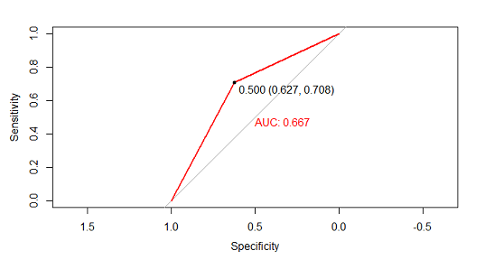
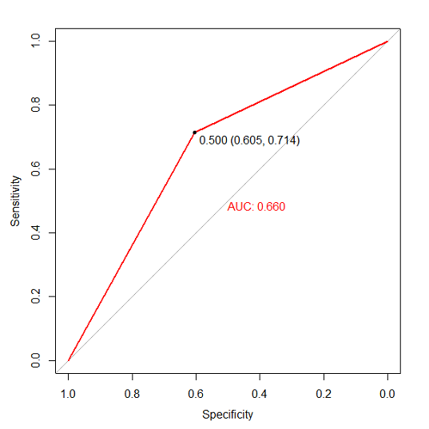
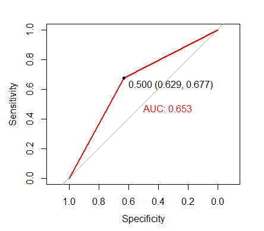
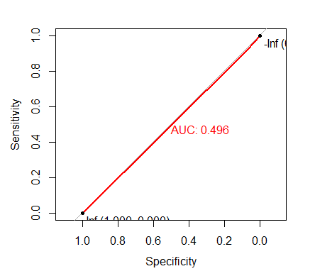
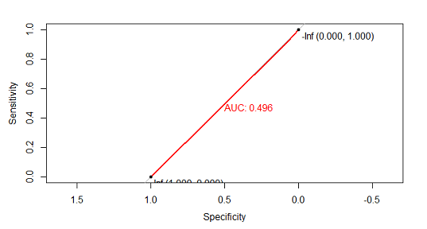
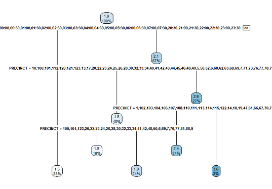
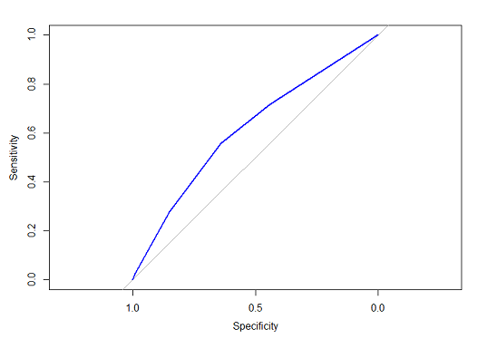

```{r, echo=FALSE, message=FALSE, warning=FALSE, error=FALSE}
#code below is NOT shown in final document
knitr::opts_chunk$set(echo = TRUE)
raw_crashesData <- read.csv('../data/Motor_Vehicle_Collisions_-_Crashes.csv')
clean_crashesData <- read.csv('../data/motor_vehicle_collisions_crashes_cleaned.csv')

#loading libraries
library(ggplot2) #for plotting graphs
library(RColorBrewer) #for organizing colour use with palettes
library(gridExtra) #layout of figures
library(data.table) #used to subset data
library(xtable)#used to print tables in the markdown document
library(knitr)#used to output to LaTeX/PDF
library(kableExtra) #more table formatting
outlineColour = brewer.pal(9, "Set1") #colour palette for outlining graphs
fillColour = brewer.pal(9, "Pastel1") #colour palette for filling graphs
```
## Abstract

Technological progress in the world has unarguably improved the quality of life for the average person in many ways. The age of the automobile has shaped the way in which work, play and live our lives. Roadways, buildings, cities and entire countries have been designed to accommodate motor vehicles. As automobile technology has advanced making cars faster and capable of more advanced maneuvers, so has our concern with the safety of these vehicles. Entire disciplines such as traffic management are devoted to optimizing numerous factors to ensure the safe and efficient movement of people and goods. As we move into the age of data, all stakeholders in the automobile industry must effectively collect and utilize the wealth of information available to better meet their goals if progress is to continue. In this project, we take the position of a law enforcement agency, the New York City Police Department, as they seek to best utilize their resources in the context of responding to traffic collisions in the city.

## Background

At the end of 2017 in New York City, there were 1,923,041 cars registered to residents of the city. (https://nyc.streetsblog.org/2018/10/03/car-ownership-continues-to-rise-under-mayor-de-blasio/) This already-significant number does not include the heavy flow of vehicles of those who visit the city or are simply passing through. By contrast, the New York City Police Department (NYPD) budgets for a headcount of 35,822 uniformed officers (http://council.nyc.gov/budget/wp-content/uploads/sites/54/2017/03/056-NYPD.pdf - page 4), distributed across 77 police precincts (geographic divisions of the city).  On-duty officers/traffic enforcement agents are allocated to each precinct to enforce traffic laws and handle emergency and administrative response to traffic incidents (such as collisions). NYC has been collecting traffic data, including specific data on vehicle collisions since 2014 to support “Vision Zero” , a traffic safety initiative which has the goal of eliminating traffic fatalities. (https://data.cityofnewyork.us/Public-Safety/Motor-Vehicle-Collisions-Crashes/h9gi-nx95/data)

## Objective

The objective of our analysis is to develop a supervised, prediction model using Machine Learning techniques and the CRISP-DM framework (cite textbook) on the available collision data to predict whether there will be a collision in a specified police precinct at a specified time. The intent of predicting this data is to inform the NYPD’s optimal assignment of limited officers and resources across the 77 police precincts.

## Data Analysis

The data set that supports this analysis is sourced from the NYC Open Data project. The title of the data set is “Motor Vehicle Collisions – Crashes”. It contains entries for every collision recorded within New York City limits by NYPD agents beginning July 1st, 2012 up to the present day. There are approximately 1.65 million entries in the data set.

## Data Dictionary

Data dictionary sourced from https://data.cityofnewyork.us/Public-Safety/Motor-Vehicle-Collisions-Crashes/h9gi-nx95/data - "MVCollisionsDataDictionary_20190813_ERD.xlsx".

```{r, data-dictionary, echo = FALSE, results = 'asis'}
data_dictionary <- read.csv('../data/data_dictionary.csv')

kable(data_dictionary[], caption = "Data Dictionary - Motor Vehicle Collisions – Crashes", format = "latex") %>% kable_styling(latex_options = "hold_position")
```

\newpage

## Initial Data Exploration and Cleaning

To begin our exploration of the data set, we'll look at a summary table for each feature. This may help inform which we would like to keep and which to remove during feature selection.

```{r echo=FALSE, message=FALSE, warning=FALSE, results='asis', fig.align="center", fig.cap="Summary Tables of All Features"}

options(xtable.comment = FALSE)
options(xtable.floating = FALSE)
print("\newline Row 1:") 
print(xtable(summary(raw_crashesData[,1:6])), include.rownames = FALSE, scalebox=0.5)
print("\newline Row 2:")  
print(xtable(summary(raw_crashesData[,7:10])), include.rownames = FALSE, scalebox=0.5)
print("\newline Row 3:")  
print(xtable(summary(raw_crashesData[,11:14])), include.rownames = FALSE, scalebox=0.5)
print("\newline Row 4:")  
print(xtable(summary(raw_crashesData[,15:18])), include.rownames = FALSE, scalebox=0.5)
print("\newline Row 5:")  
print(xtable(summary(raw_crashesData[,19:22])), include.rownames = FALSE, scalebox=0.5)
print("\newline Row 6:")  
print(xtable(summary(raw_crashesData[,23:26])), include.rownames = FALSE, scalebox=0.5)
print("\newline Row 7:")  
print(xtable(summary(raw_crashesData[,26:29])), include.rownames = FALSE, scalebox=0.5)

```

<p>

</p>

Based on what we know about the data set from the specifications at NYC Open Data and the data dictionary, we have decided to perform some initial cleaning steps.

Our analytics problem is to predict whether there will be a collision at a specific time (time including a time of the day, day of the year and calendar year). In this context, we will first look at the "CRASH.DATE" graph. Thinking about the scheduling of police resource, we assume that this happens in advance, on a hour-by-hour and day-by-day basis. We assume that resources are not scheduled on a year-by-year basis due to uncertainty in staffing, budget, etc. We therefore examine the data to see whether we should include the year at all. Including the year would treat the data set as a time-series, years ranging from 2012-2020. Alternatively, we could drop the year and group all occurrences on the same day in the same bin, possibly enhancing our prediction.

To decide, we plot the dates and look for trends. If trends repeat annually, we will drop the year as this trend will be preserved when we combine. If the trend does not repeat annually (extends over the whole range of dates) then we will not combine year as we will lose this information when dropping year.

\newpage

```{r echo=FALSE, message=FALSE, warning=FALSE, fig.align="center", fig.cap="Collisions per Day - All Years"}
raw_crash_dates <- as.Date(raw_crashesData$CRASH.DATE, "%m/%d/%Y")
raw_crash_dates_df <- as.data.frame(raw_crash_dates)

setDT(raw_crash_dates_df)

raw_crash_dates_df <- raw_crash_dates_df[raw_crash_dates_df$raw_crash_dates > "2013-01-01", ]
raw_crash_dates_df <- raw_crash_dates_df[raw_crash_dates_df$raw_crash_dates < "2019-01-01", ]


clean_crash_dates <- raw_crash_dates
clean_crash_dates <- format(clean_crash_dates, format="%m/%d")
clean_crash_dates <- as.Date(clean_crash_dates, "%m/%d")
clean_crash_dates_df <- as.data.frame(clean_crash_dates)
#density plot of dates with all years
plot_rawCrashDates <- ggplot(raw_crash_dates_df, aes(x=raw_crash_dates_df$raw_crash_dates)) + 
  geom_density(fill=fillColour[1], colour=outlineColour[1], alpha = 0.4) + 
  geom_vline(aes(xintercept=as.numeric(as.Date("2013-01-01"))),color="black", linetype="solid", size=1) +
  geom_vline(aes(xintercept=as.numeric(as.Date("2014-01-01"))),color="black", linetype="solid", size=1) + 
  geom_vline(aes(xintercept=as.numeric(as.Date("2015-01-01"))),color="black", linetype="solid", size=1) + 
  geom_vline(aes(xintercept=as.numeric(as.Date("2016-01-01"))),color="black", linetype="solid", size=1) + 
  geom_vline(aes(xintercept=as.numeric(as.Date("2017-01-01"))),color="black", linetype="solid", size=1) + 
  geom_vline(aes(xintercept=as.numeric(as.Date("2018-01-01"))),color="black", linetype="solid", size=1) + 
  geom_vline(aes(xintercept=as.numeric(as.Date("2019-01-01"))),color="black", linetype="solid", size=1) + 
  geom_vline(aes(xintercept=as.numeric(as.Date("2020-01-01"))),color="black", linetype="solid", size=1) +
  xlab("Collisions per Day") + ylab("Density") + labs(title = "All Years")

#density plot of all dates with combined year
plot_cleanCrashDates <- ggplot(clean_crash_dates_df, aes(x=clean_crash_dates_df$clean_crash_dates)) +
  geom_density(fill=fillColour[1], colour=outlineColour[1], alpha = 0.4) +
  xlab("Collisions per Day") + ylab("Density") + labs(title = "Years Combined")

plot_rawCrashDates
rm(plot_rawCrashDates)
```
The vertical black lines in the “All Years” plot represent the start of each year. As you can see from the plot, there is a noticeable repeating trend in each year (between the black lines) with a decrease in collisions at the start of each year, followed by various other increase/decreases.
As we are more interested in capturing this repeating annual trend than year-over-year changes, we will combine all data into a representation of one year.
Additionally, we will drop years 2012 and 2020 (the first and last years in the data set) to avoid over/under-representing specific months in the combined-year data set. This leaves us with the “Years Combined” data set plotted below.

We use the following code to keep only data in 2013 onwards and in prior to 2020, as mentioned.

```{r echo=TRUE, eval=FALSE}
raw_crash_dates_df <- raw_crash_dates_df[raw_crash_dates_df$raw_crash_dates > "2013-01-01", ]
raw_crash_dates_df <- raw_crash_dates_df[raw_crash_dates_df$raw_crash_dates < "2020-01-01", ]
```

```{r echo=FALSE, message=FALSE, warning=FALSE, fig.align="center", fig.cap="Collisions per Day - Years Combined"}
plot_cleanCrashDates
rm(plot_cleanCrashDates)
```
\newpage

# Feature Engineering

The business problem, in simple terms, is that the NYPD wants to deploy their police force optimally through predicting collisions. From that very statement, it is clear that the required fields are CRASH.DATE, CRASH.TIME, LATITUDE, LONGITUDE and collisions. The other fields are either redundant (borough & zip code which are redundant to longitude & latitude) or not directly relevant to the problem (street names, number of pedestrians, cyclists, motorists injured or killed. These are ancillary and a deeper level of data and not required to solve the problem). Depending on whether a classification model or a regression model was used, "Collisions" were treated as binary (did crash happen, Y/N?) or as a sum, respectively. Through further research, it was found that NYPD manages NY city by Precincts. A precinct is a district of a city or town defined for police purposes. The NYC open data website also has data about precincts and their shape files. These shape files were used to convert every Longitude, Latitude point into a precinct by finding out the shape polygon in which that Longitude, Latitude point fell. Further, for all classification models, the data was imputed with '0' collisions data where needed, as the original data contained only crashes.

# Primary Data Cleaning

## The Problem

While the Motor Vehicle Collisions – Crashes" dataset on NYC Open Data contains every motor vehicle collision within the City of New York, there is a singular problem with this dataset that prevents us from using it for the purpose of creating a supervised, binary classification model: it only contains positive observations (i.e. motor vehicle crashes). Therefore, to make this dataset usable for the intended supervision problem as stated, negative observations must be created to complement the dataset. In addition, a binary response variable would be created afterwards to identify the positive and negative observations.

However, the creation of negative observations itself is not a simple problem to solve. for our motor vehicle collision dataset. Each row of the dataset represents a specific motor vehicle collilsion at a particular point in time, as represented by the `CRASH DATE` and `CRASH TIME` columns, and a particular point in space, as represented by the `LATITUDE` and `LONGITUDE` columns. For every motor vehicle collision that has been captured by the dataset, there are potentially thousands, or even hundreds of thousands of collisions that did not happen at any given point in time or space. To put into perspective, let us look at the statistics to show a rough estimate that the likelihood of an average driver being a participant of a car crash. For example, of the 3.8 million commuters in New York City on a regular workday, approximately 27% of the commuters do so by car, truck, or van (https://edc.nyc/article/new-yorkers-and-their-cars). Assuming that half the commuters carpool (https://www.citylab.com/transportation/2019/01/commuting-to-work-data-car-public-transit-bike/580507/), and the rest drive solo, this would mean, at the very least, there are a bit more than half a million vehicles on the road on any given workday.  Out of the half a million or so vehicles on New York City roads, there are only about 678 car crashes in New York each day (https://www.dandalaw.com/are-car-accidents-common-in-new-york-city/, but ideally we should calculate this from our dataset!!!). All these numbers point out that getting into a motor vehicle collision, even in a city with an unsafe road reputation like New York, is an unlikely event. 

Consequently, to generate negative observations would yield a hugely imblanaced dataset, consisting mostly of negative observations, and very few positive observations. In addition, these negative observations would also have to have generated features, such as `CRASH DATE`, `CRASH TIME`, `LATITUDE`, `LOGITUDE`, etc. This itself is also another issue, as we cannot randomly generate those features without understanding the distribution of New York City traffic across different areas and times, since some boroughs of New York, such as Staten Island, will have less traffic, and therefore less motor vehicle accidents than other boroughs (we should ideally show graphs of the number of accidents per borough).

## The Proposed Solution

An easier solution to the problem of generating negative observations is to: (a) group the positive observations by pre-determined datetime ranges, and pre-determined geolocation areas, (b) aggregate the number motor vehicle collisions into a column containing the counts of motor vehicle crashes given a pre-determined datetime range, and pre-determined geolocation area, and (c) via inference, generate negative observations from the grouped, and aggregated positive observations. By generalizing both the time and space of motor vehicle collisions, the generation of negative observations will not likely create a highly imbalnaced dataset that heavily skewers towards the negative class, but also there is now no need to generate those features whilst having to research the New York City traffic flow across different space-time groups. Nevertheless, it is still important to determine an appropriate datetime range, and geo-location areas to bin the observations; it must be taken into account these pre-determined datetime ranges, and geo-location areas should not only prevent extreme class imbalance towards either positive or negative class, but also be relevant to our business problem. 

For this particular business problem, it would make sense to use New York Police Department precincts as the pre-determined geolocation areas group the positive observations by. This made sense given our business problem was from a NYPD point of view, as they could divert police resources from other precincts that are less likely to experience motor crashes to other precincts with potentially higher collision rates. We also experimented to use hourly bins, as we felt it would be useful for the police to accurately predict which precinct would likely have more motor vehicle accidents. Overall, using hourly bins and NYPD precincts allowed the dataset to have 77% negative observations, and roughly 23% positive observations, which was good enough to have only a moderate imbalance.


## Creation of the Precinct column

To map the NYPD precinct, the GeoJson containing all the MultiPolygons of NYPD precincts was downloaded from https://data.cityofnewyork.us/Public-Safety/Police-Precincts/78dh-3ptz. Each MultiPolygon consists of an array of Polygons, and in turn, each Polygon consists of an array of Latitude and Longitude coordinates. Looping through each positive observation in the dataset, the correct precinct would be assigned to each positive observation. 

As an example: 

CRASH DATETIME     | LATITUDE      | LONGITUDE    | PRECINCT     |
-----------------  | ------------- | ------------ | ------------ |
06/09/2019 11:32   | 40.725210     | -73.995860   | 5            |
06/09/2019 12:55   | 40.586680	   | -73.945114   | 61           |
06/09/2019 11:11   | 40.720626     | -73.994971   | 5            |

## Creation of a CRASH_BINARY column

We then create a `CRASH_BINARY` column for each positive observation. All of the positive observations will have a `CRASH_BINARY` value of 1, denoting a positive observation.

CRASH DATETIME     | LATITUDE      | LONGITUDE    | PRECINCT     | CRASH_BINARY  |
-----------------  | ------------- | ------------ | ------------ | ------------- |
06/09/2019 11:32   | 40.725210     | -73.995860   | 5            |  1            |
06/09/2019 12:55   | 40.586680	   | -73.945114   | 61           |  1            |
06/09/2019 11:11   | 40.720626     | -73.994971   | 5            |  1            |


## Round Date Time to nearest Hour

We round the `CRASH DATETIME` column to the nearest hour. It is always rounded down (i.e. if it is 11:59AM for example, it is rounded down to 11AM).

ROUNDEDCRASH DATETIME     | LATITUDE      | LONGITUDE    | PRECINCT     | CRASH_BINARY  |
------------------------  | ------------- | ------------ | ------------ | ------------- |
06/09/2019 11:00          | 40.725210     | -73.995860   | 5            |  1            |
06/09/2019 12:00          | 40.586680	    | -73.945114   | 61           |  1            |
06/09/2019 11:00          | 40.720626	    | -73.994971   | 5            |  1            |

## Creation of Negative Observations

After assigning a precinct to each positive positive observation, negative observations must now be created. We first group the positive obserations by `PRECINCT` and `CRASH DATETIME`, and aggregate the groups by the sum by CRASH_BINARY

ROUNDEDCRASH DATETIME     |  PRECINCT     | CRASH_BINARY SUM  |
------------------------  | ------------- | ----------------  |
06/09/2019 11:00          |  5            |  2                |
06/09/2019 12:00          |  61           |  1                |

We will also need to create negative observations. In this small example, there would be no crash accidents in Precinct 61 at 11AM, and the same could be said for Precinct 5 at 12AM. For the real dataset, this imputation of negative observations was done for all possible permutations of precincts (77 possible precincts) and hourly bins (24 hourly bins), but it is not shown in the example due to its length. Therefore, for each day, there are a total of 1848 possible observations, whether positive or negative. CRASH_BINARY SUM for these negative observations are assigned a numeric value of 0.

ROUNDEDCRASH DATETIME     |  PRECINCT     | CRASH_BINARY SUM  |
------------------------  | ------------- | ----------------  |
...                       |  ...          |  ...              |
06/09/2019 10:00          |  61           |  0                |
06/09/2019 11:00          |  5            |  2                |
06/09/2019 11:00          |  61           |  0                |
06/09/2019 12:00          |  5            |  0                |
06/09/2019 12:00          |  61           |  1                |
06/09/2019 13:00          |  5            |  0                |
...                       |  ...          |  ...              |

## Split Datetime into MONTH, WEEK, DAY, WEEKDAY, and HOUR

Lastly, for each datetime observation, the datetime was split into its corresponding month (month of the year), week (week of the year), day (day of the month), weekday (0 to 6, where 0 represents Monday, and 6 represents Sunday), and of course hour (in 24-hour time).


Lastly, for each datetime observation, the datetime was split into its corresponding month (month of the year), week (week of the year), day (day of the month), weekday (0 to 6, where 0 represents Monday, and 6 represents Sunday), and of course hour (in 24-hour time).

ROUNDEDCRASH DATETIME     |  PRECINCT     | CRASH_BINARY SUM  | MONTH |
------------------------  | ------------- | ----------------  | ----- |
...                       |  ...          |  ...              | ...   | 
06/09/2019 10:00          |  61           |  0                | 9     |
06/09/2019 11:00          |  5            |  2                | 9     |
06/09/2019 11:00          |  61           |  0                | 9     |
06/09/2019 12:00          |  5            |  0                | 9     |
06/09/2019 12:00          |  61           |  1                | 9     |
06/09/2019 13:00          |  5            |  0                | 9     |
...                       |  ...          |  ...              | ...   |

[*table continued below*]

 WEEK |  DAY |  WEEKDAY | HOUR |
----- | ---- | -------- | ---- |
...   | ...  | ...      | ...  | 
36    | 6    | 4        | 10   |
36    | 6    | 4        | 11   |
36    | 6    | 4        | 11   |
36    | 6    | 4        | 12   |
36    | 6    | 4        | 12   |
36    | 6    | 4        | 13   |
 ...  | ...  | ...      | ...  |


## Cleaned Data Exploration

Now that we've completed our data cleaning, let's explore the cleaned-up data in more detail. Below, we look at the denstity distribution of each feature (in terms of total occurrences in the data set).

\newpage

## Density Plots

```{r data-exploration, echo=FALSE, message=FALSE, warning=FALSE, fig.align="center", fig.cap="Plots of Selected Features"}
rm(raw_crashesData)
plot1 <- ggplot(as.data.frame(clean_crashesData$precinct), aes(x=clean_crashesData$precinct)) +
  geom_density(fill=fillColour[1], colour=outlineColour[1], alpha = 0.4) +
  xlab("Precincts") + ylab("Density") + labs(title = "Police Precints")

#plot2 <- ggplot(as.data.frame(clean_crashesData$timestamp), aes(x=clean_crashesData$timestamp)) +
#  geom_density(fill=fillColour[2], colour=outlineColour[2], alpha = 0.4) +
#  xlab("Date + Time") + ylab("Density") + labs(title = "Raw Timestamp")

plot3 <- ggplot(as.data.frame(clean_crashesData$month), aes(x=clean_crashesData$month)) +
  geom_density(fill=fillColour[3], colour=outlineColour[3], alpha = 0.4) +
  xlab("Month") + ylab("Density") + labs(title = "Month of the Year")

plot4 <- ggplot(as.data.frame(clean_crashesData$week), aes(x=clean_crashesData$week)) +
  geom_density(fill=fillColour[4], colour=outlineColour[4], alpha = 0.4) +
  xlab("Week") + ylab("Density") + labs(title = "Week of the Year")

plot5 <- ggplot(as.data.frame(clean_crashesData$day), aes(x=clean_crashesData$day)) +
  geom_density(fill=fillColour[5], colour=outlineColour[5], alpha = 0.4) +
  xlab("Day") + ylab("Density") + labs(title = "Day of the Year")

plot6 <- ggplot(as.data.frame(clean_crashesData$weekday), aes(x=clean_crashesData$weekday)) +
  geom_density(fill=fillColour[6], colour=outlineColour[6], alpha = 0.4) +
  xlab("Day (in Week)") + ylab("Density") + labs(title = "Day of the Week")

plot7 <- ggplot(as.data.frame(clean_crashesData$hour), aes(x=clean_crashesData$hour)) +
  geom_density(fill=fillColour[7], colour=outlineColour[7], alpha = 0.4) +
  xlab("Hour") + ylab("Density") + labs(title = "Hour of the Day")

plot8 <- ggplot(as.data.frame(clean_crashesData$total_number_of_crashes), aes(x=clean_crashesData$total_number_of_crashes)) +
  geom_bar(fill=fillColour[8], colour=outlineColour[8], alpha = 0.4) +
  xlab("Crashes") + ylab("Density") + labs(title = "# of Crashes at Time")

plot9 <- ggplot(as.data.frame(clean_crashesData$did_crash_happen), aes(x=clean_crashesData$did_crash_happen)) +
  geom_bar(fill=fillColour[9], colour=outlineColour[9], alpha = 0.4) +
  xlab("Crash?") + ylab("Density") + labs(title = "Crash=0/1 at Time")

grid.arrange(plot1, plot3, plot4, plot5, plot6, plot7, plot8, plot9)

rm(plot1, plot3, plot4, plot5, plot6, plot7, plot8, plot9)

```

\newpage

# Models

As we worked through the data set, we were unsure as to which supervised machine learning models would best suit our business needs. As such, we have run, evaluated and compared the following 6 models:

* Decision Tree
* Gradient Boosting
* K-Nearest Neighbor
* Logistic Regression
* Random Forest
* Regression Tree (Decision Tree Alternate Output)
   + In this model we attempted to outut # of crashes rather than a binary variable for crash/no crash.

## Decision Tree

```{r decision-tree-code, echo=FALSE, message=FALSE, warning=FALSE, eval=FALSE}
crashdata <- read.csv("../data/motor_vehicle_collisions_crashes_cleaned.csv", header = TRUE, na.strings = c("NA","","#NA"))

crashdata <- crashdata[c('precinct', 'month', 'week', 'day', 'weekday', 'hour', 'did_crash_happen')]

crashdata$precinct <- as.character(crashdata$precinct)

library(caTools)
set.seed(123)
data_sample = sample.split(crashdata$hour, SplitRatio=0.80)
train_data = subset(crashdata,data_sample==TRUE)
test_data = subset(crashdata,data_sample==FALSE)
dim(train_data)
dim(test_data)

library(rpart)
library(rpart.plot)
library(pROC)

fit <- rpart(did_crash_happen ~ ., train_data, method="anova")
fit$cptable[which.min(fit$cptable[,"xerror"]),"CP"]
prune(fit, cp=0.01)
predicted_val <- predict(fit, test_data)
#probability <- predict(fit, test_data, type = 'prob')

splitfun <- function(x, labs, digits, varlen, faclen)
{
  # replace commas with spaces (needed for strwrap)
  labs <- gsub(",", " ", labs)
  for(i in 1:length(labs)) {
    # split labs[i] into multiple lines
    labs[i] <- paste(strwrap(labs[i], width = 40), collapse = "\n")
  }
  labs
}

# Generate the plots
rpart.plot(fit, main="Regression Tree", box.palette = "Blues", under=TRUE, roundint = FALSE, clip.right.labs = FALSE, type=3, split.fun=splitfun)
rpart.rules(fit, cover=TRUE, roundint = FALSE)
auc.rp = roc(test_data$did_crash_happen, factor(predicted_val, ordered = TRUE), plot = TRUE, col = "blue")
#post(fit, file = "tree.ps", title = "Pruned Regression Tree for Crashes")
auc(test_data$did_crash_happen, predicted_val)
auc.rp

# Save the model into a file
save(fit, file="fittedRegTreeModel.rda")
```

The Decision tree algorithm is a simple tree based algorithm that allows for easy modeling and interpretation to the end business user. Though understood to be computationally complex, the model works well in the given context and helps identify if there will be a collision for a given Police Precinct.

<p>

\newline
**Figure: Decision Tree Visualization of Branches**

\newline
**Figure: Decision Tree AUC/ROC Curve**
</p>

## Stochastic Gradient Boosting (GBM)

```{r gbm-code, echo=FALSE, message=FALSE, warning=FALSE, eval=FALSE}
#install.packages('dplyr')
#install.packages('gbm')
#install.packages('caTools')
#install.packages('pROC')
#install.packages('doParallel')
#install.packages('caret')
#install.packages('e1071', dependencies=TRUE)
#install.packages('DMwR')
#install.packages('ROSE')

library(dplyr)
library(gbm)
library(caTools)
library(pROC)
library(doParallel)
library(caret)
#library(DMwR)
#library(ROSE)
library(MLmetrics)

#setup cluster (forget about this lmao)
#cl <- makePSOCKcluster(2) #4 clusters on my machine
#registerDoParallel(cl)


motor_collision_crash_clean_data <- read.csv("C:\\Users\\alexf\\Documents\\CSML1000\\Assignments\\CSML1000-Group-10-assignment-1\\data\\motor_vehicle_collisions_crashes_cleaned.csv")

#data <- select(motor_collision_crash_clean_data, -c(id, timestamp, total_number_of_crashes))
data <- select(motor_collision_crash_clean_data, -c(id, total_number_of_crashes))

data$timestamp = as.Date(data$timestamp)
data$precinct = as.factor(data$precinct)
data$month = as.numeric(data$month)
data$week = as.numeric(data$week)
data$day = as.numeric(data$day)
data$weekday = as.numeric(data$weekday)
data$hour = as.numeric(data$hour)
data$did_crash_happen = as.factor(
  ifelse(data$did_crash_happen ==  0, "no", "yes")
)

#time series split
# myTimeControl <- trainControl(method = "timeslice",
#                               initialWindow = 674520,
#                               horizon = 674520,
#                               fixedWindow =  TRUE,
#                               #allowParallel = TRUE,
#                               verboseIter = TRUE#,
#                               #sampling = "smote"
#                               )

#create time slices
# timeSlices <- createTimeSlices(1:nrow(data),
#                                initialWindow = 36, horizon = 12, fixedWindow = TRUE)
# trainSlices <- timeSlices[[1]]
# testSlices <- timeSlices[[2]]

#separate the data into train and test
#because we run into memory issues 
#train_data will be the data from 2017-01-
#test_data will be from 2019-01-26 till 2020-01-26
trainData_older = data[data$timestamp < '2017-01-27', ]
trainData = data[data$timestamp > '2017-01-27' & data$timestamp < '2019-01-27', ]
testData = data[data$timestamp > '2019-01-26', ]

#splitting by timestamp
# splitIdx = createDataPartition(data$did_crash_happen, p=0.7, list = FALSE)  # 70% training data, 30% testing
# trainData = data[splitIdx, ]
# testData = data[-splitIdx, ]

#we will need to upsample the trainData
set.seed(123)
columns = colnames(trainData)
trainData_upsampled = upSample(
  x = trainData[, columns[columns != "did_crash_happen"] ], 
  y = trainData$did_crash_happen, list = F, yname = "did_crash_happen"
)
print(table(trainData_upsampled$did_crash_happen))

set.seed(456)
#try downsampling instead...
trainData_downsampled = downSample(
  x = trainData[, columns[columns != "did_crash_happen"] ], 
  y = trainData$did_crash_happen, list = F, yname = "did_crash_happen"
)
print(table(trainData_downsampled$did_crash_happen))


gbm.trainControl = trainControl(
  method = "cv", 
  number = 3, # it takes forever for 10 - fold 
  # Estimate class probabilities
  classProbs = TRUE,
  # Evaluate performance using the following function
  summaryFunction = twoClassSummary,
  allowParallel = TRUE,
  verbose = TRUE
)

#make sure we get rid as much useless data objects in R environment as possible
gc()
rm(motor_collision_crash_clean_data, data, trainData, trainData_older)
rm(trainData_upsampled)
#rm(trainData_downsampled)
gc()
memory.limit()
memory.limit(size=30000)

#tuneGrid
gbmGrid <- expand.grid(
  #interaction.depth = c(10, 20),
  #n.trees = c(50, 100, 250),
  interaction.depth = c(20),
  n.trees = c(200),
  n.minobsinnode = 10,
  shrinkage = .1
)

#train model
set.seed(789)
ptm_rf <- proc.time()
model_gbm <- train(
  did_crash_happen ~ . - timestamp,
  #data = data[trainSlices[[1]],],
  data = trainData_downsampled,
  #data = train_data,
  method = "gbm",
  #family="gaussian",
  #distribution = "gaussian",
  trControl = gbm.trainControl,
  #tuneLength = 5
  tuneGrid = gbmGrid
)
proc.time() - ptm_rf

#when we are done with parallel processing needs
#stopCluster(cl)

#make predictions aginst testData with the new model 
print(model_gbm)
pred.model_gbm.prob = predict(model_gbm, newdata = testData, type="prob")
pred.model_gbm.raw = predict(model_gbm, newdata = testData)


roc.model_gbm = pROC::roc(
  testData$did_crash_happen, 
  as.vector(ifelse(pred.model_gbm.prob[,"yes"] >0.5, 1,0))
)
auc.model_gbm = pROC::auc(roc.model_gbm)
print(auc.model_gbm)

#plot ROC curve
plot.roc(roc.model_gbm, print.auc = TRUE, col = 'red' , print.thres = "best" )

#generate confusion matrix, as well as other metrics such as accuracy, balanced accuracy
confusionMatrix(data = pred.model_gbm.raw, testData$did_crash_happen)

#summary of model 
summary(model_gbm)

#see the different metrics and roc curve this model scored against trainData_downsampled
pred.model_gbm.train.prob = predict(model_gbm, newdata = trainData_downsampled, type="prob")
pred.model_gbm.train.raw = predict(model_gbm, newdata = trainData_downsampled)

roc.model_gbm.train = pROC::roc(
  trainData_downsampled$did_crash_happen, 
  as.vector(ifelse(pred.model_gbm.train.prob[,"yes"] >0.5, 1,0))
)
auc.model_gbm.train = pROC::auc(roc.model_gbm.train)
print(auc.model_gbm.train)

#plot ROC curve
plot.roc(roc.model_gbm.train, print.auc = TRUE, col = 'blue' , print.thres = "best" )

#generate confusion matrix, as well as other metrics such as accuracy, balanced accuracy
confusionMatrix(data = pred.model_gbm.train.raw, trainData_downsampled$did_crash_happen)

# Save the model into a file
save(model_gbm, file="caret_gbm.rda")

```

Stochastic Gradient Boosting is a method of supervised learning, where it continuously iterates over each tree one at a time to boost the performance of its weaker learners. Unlike other types of Gradient Boosting algorithms, Stochastic Gradient Boosting allows a base learner to draw samples randomly from the training set. There were a few hyperparamters to tune: `n.trees` denotes the number of trees, `interaction.depth` denotes the maximum depth of each tree, `n.minobsinnode` denotes the minimum number of observations in the final node of the trees, and `shrinkage` denotes the shrinkage, or learning rate for each tree. We used a grid search for finding the appropriate hyperparameters for gbm, with values of 10 and 20 for `interaction.depth`, and values of 50, 100, and 250 for `n.trees`. For the other hyperparameters, we left `n.minobsinnode` at 10, and `shrinkage` at 0.1. We found the gbm model performed the best, in terms of metrics, at a `interaction.depth` of 20, and a `n.trees` of 250, although doing so also increased the time to train the gbm model. 

<p>


\newline
**Figure: Stochastic Gradient Boosting (GBM) AUC/ROC Curve**

</p>

**Stochastic Gradient Boosting (GBM) Confusion Matrix and Statistics**
```{r echo=TRUE, message=FALSE, warning=FALSE, eval=FALSE}
          Reference
Prediction     no    yes
       no  326251  44978
       yes 194322 109046
                                          
               Accuracy : 0.6453          
                 95% CI : (0.6441, 0.6464)
    No Information Rate : 0.7717          
    P-Value [Acc > NIR] : 1               
                                          
                  Kappa : 0.2495          
                                          
 Mcnemar's Test P-Value : <2e-16          
                                          
            Sensitivity : 0.6267          
            Specificity : 0.7080          
         Pos Pred Value : 0.8788          
         Neg Pred Value : 0.3595          
             Prevalence : 0.7717          
         Detection Rate : 0.4836          
   Detection Prevalence : 0.5503          
      Balanced Accuracy : 0.6673          
                                          
       'Positive' Class : no              
```

## Logistic Regression

```{r logistic-regression-code, echo=FALSE, message=FALSE, warning=FALSE, eval=FALSE}
library(dplyr)
library(caTools)
library(pROC)
library(caret)
library(e1071)

motor_collision_crash_clean_data <- read.csv("C:\\Users\\Alex Fung\\Documents\\CSML1000\\CSML1000-Group-10-assignment-1\\data\\motor_vehicle_collisions_crashes_cleaned.csv")

#data <- select(motor_collision_crash_clean_data, -c(id, timestamp, total_number_of_crashes))
data <- select(motor_collision_crash_clean_data, -c(id, total_number_of_crashes))

#set columns as appropriate
data$timestamp = as.Date(data$timestamp)
data$precinct = as.factor(data$precinct)
data$month = as.ordered(data$month)
data$week = as.ordered(data$week)
data$day = as.ordered(data$day)
data$weekday = as.ordered(data$weekday)
data$hour = as.ordered(data$hour)
data$did_crash_happen = as.factor(
  ifelse(data$did_crash_happen == 0, "no", "yes")
)

#separate data into train and test
#because we run into memory issues
#trainData will be two years' worth, from 2017 Jan to 2019 Jan
#testData will be from 2019 Jan onwards
#a separate 'trainData_older' will be all the data from 2017 Jan and before
trainData_older = data[data$timestamp < '2017-01-27', ]
trainData = data[data$timestamp > '2017-01-27' & data$timestamp < '2019-01-27', ]
testData = data[data$timestamp > '2019-01-27', ]

#we will need to downsample the trainData
set.seed(123)
columns = colnames(trainData)
trainData_downsampled = downSample(
  x = trainData[, columns[columns != 'did_crash_happen']],
  y = trainData$did_crash_happen, list = FALSE, yname = 'did_crash_happen'
)
print(table(trainData_downsampled$did_crash_happen))

glm.trainControl = trainControl(
  method = "cv", 
  number = 5, 
  #Estimate class probabilities
  classProbs = TRUE,
  #Evaluate performance using the following function
  summaryFunction = twoClassSummary,
  allowParallel = TRUE,
  verbose = TRUE
)

#make sure we get rid as much useless data objects in R environment as possible
gc()
rm(motor_collision_crash_clean_data, data, trainData)
gc()
memory.limit()
memory.limit(size = 16000)

#no need to tuneGrid because logistic regression using glm has no parameters
#train model
set.seed(789)
ptm_rf <- proc.time()
model_glm <- train(
  did_crash_happen ~ . - timestamp, 
  data = trainData_downsampled,
  method = 'glm',
  trControl = glm.trainControl
)
proc.time() - ptm_rf

#make prediction against testData with the new model
print(model_glm)
pred.model_glm.prob = predict(model_glm, newdata = testData, type="prob")
pred.model_glm.raw = predict(model_glm, newdata = testData)

roc.model_glm = pROC::roc(
  testData$did_crash_happen,
  as.vector(ifelse(pred.model_glm.prob[,"yes"] > 0.5, 1, 0))
)
auc.model_glm = pROC::auc(roc.model_glm)
print(auc.model_glm)

#plot ROC curve
plot.roc(roc.model_glm, print.auc = TRUE, col = 'red', print.thres = "best")

#generate confusion matrix, as well as other metrics such as accuracy, balanced accuracy
confusionMatrix(data = pred.model_glm.raw, testData$did_crash_happen)

#summary of model
summary(model_glm)

```

Logistic regression is a useful model for the purposes for binary classification. For a parametric model, it does not have many assumptions to satisfy. The first assumption is that logistic regression requires a large dataset of observations to make accurate predictions. This is fulfilled in this situation quit easily: there are 5 million positive and negative observations in total to train a logistic regression model. The second assumption is that the observations are made independent of one another. This is true in this situation, as the positive observations were made from the grouped and aggregated sum of accidents, and the negative observations were inferred from the lack of positive observations in the dataset for a particular precinct and hourly bin. The third assumption is that the response variable must be binary, which is true in our case because it is either a 1 or 0. However, there are two other assumptions which we unfortunately did not have the time to ascertain their certainty, namely that the predictor variables are related to the logit function, and that there is minimal multicollinearity among the predictor variables. 

Nevertheless, the logistic regression model showed an ROC curve that was not far from the two other best models, namely decision tree and gbm. One of the benefits of logistic regression is that there are no hyperparameters to tune, which made generating the model easier as there was no need to do validation.

<p>


\newline
**Figure: Generalized Linear Model AUC/ROC Curve**

</p>

**Generalized Linear Model Confusion Matrix and Statistics**
```{r echo=TRUE, message=FALSE, warning=FALSE, eval=FALSE}
          Reference
Prediction     no    yes
       no  314273  43937
       yes 204801 109738
                                          
               Accuracy : 0.6303          
                 95% CI : (0.6291, 0.6314)
    No Information Rate : 0.7716          
    P-Value [Acc > NIR] : 1               
                                          
                  Kappa : 0.2335          
                                          
 Mcnemar's Test P-Value : <2e-16          
                                          
            Sensitivity : 0.6054          
            Specificity : 0.7141          
         Pos Pred Value : 0.8773          
         Neg Pred Value : 0.3489          
             Prevalence : 0.7716          
         Detection Rate : 0.4671          
   Detection Prevalence : 0.5325          
      Balanced Accuracy : 0.6598          
                                          
       'Positive' Class : no  
```

## Random Forest (rf)
```{r random-forest-code, echo=FALSE, message=FALSE, warning=FALSE, eval=FALSE}
library(dplyr)
library(caTools)
library(pROC)
library(doParallel)
library(caret)
#library(DMwR)
#library(ROSE)
library(MLmetrics)
library(randomForest)

#setup cluster (forget about this lmao)
#cl <- makePSOCKcluster(2) #4 clusters on my machine
#registerDoParallel(cl)


motor_collision_crash_clean_data <- read.csv("C:\\Users\\alexf\\Documents\\CSML1000\\Assignments\\CSML1000-Group-10-assignment-1\\data\\motor_vehicle_collisions_crashes_cleaned.csv")

#data <- select(motor_collision_crash_clean_data, -c(id, timestamp, total_number_of_crashes))
data <- select(motor_collision_crash_clean_data, -c(id, total_number_of_crashes))

data$timestamp = as.Date(data$timestamp)
data$precinct = as.character(data$precinct)
data$month = as.numeric(data$month)
data$week = as.numeric(data$week)
data$day = as.numeric(data$day)
data$weekday = as.numeric(data$weekday)
data$hour = as.numeric(data$hour)
data$did_crash_happen = as.factor(
  ifelse(data$did_crash_happen ==  0, "no", "yes")
)

set.seed(123)
data_newer = data[data$timestamp > '2018-01-27', ]
data_sample = sample.split(data_newer$hour,SplitRatio=0.80)
trainData = subset(data_newer, data_sample==TRUE)
testData = subset(data_newer, data_sample==FALSE)

trainData <- select(trainData, -c(timestamp))
testData <- select(testData, -c (timestamp))

set.seed(123)
columns = colnames(trainData)
trainData_upsampled = upSample(
  x = trainData[, columns[columns != "did_crash_happen"] ], 
  y = trainData$did_crash_happen, list = F, yname = "did_crash_happen"
)
print(table(trainData_upsampled$did_crash_happen))

#try downsampling instead...
trainData_downsampled = downSample(
  x = trainData[, columns[columns != "did_crash_happen"] ], 
  y = trainData$did_crash_happen, list = F, yname = "did_crash_happen"
)
print(table(trainData_downsampled$did_crash_happen))

#remove unnecessary data objects
rm(motor_collision_crash_clean_data, data, data_newer, data_sample, trainData)
rm(trainData_upsampled)
gc()

set.seed(123)
ptm_rf <- proc.time()
#random forest @ 500 trees, mtry = 2 
model_rf = randomForest(
  did_crash_happen ~ .,
  data = trainData_downsampled,
  importance = TRUE,
  do.trace=10,
  ntree = 250,
  mtry = 2
)
proc.time() - ptm_rf


pred.model_rf.prob = predict(model_rf, newdata = testData, type="prob")
pred.model_rf.raw = predict(model_rf, newdata = testData)

roc.model_rf = pROC::roc(
  testData$did_crash_happen, 
  as.vector(ifelse(pred.model_rf.prob[,"yes"] >0.5, 1,0))
)
auc.model_rf = pROC::auc(roc.model_rf)
print(auc.model_rf)

plot.roc(roc.model_rf, print.auc = TRUE, col = 'red' , print.thres = "best" )

confusionMatrix(data = pred.model_rf.raw, testData$did_crash_happen)

#summary of model 
summary(model_rf)

#see the different metrics and roc curve this model scored against trainData_downsampled
pred.model_rf.train.prob = predict(model_rf, newdata = trainData_downsampled, type="prob")
pred.model_rf.train.raw = predict(model_rf, newdata = trainData_downsampled)

roc.model_rf.train = pROC::roc(
  trainData_downsampled$did_crash_happen, 
  as.vector(ifelse(pred.model_rf.train.prob[,"yes"] >0.5, 1,0))
)
auc.model_rf.train = pROC::auc(roc.model_rf.train)
print(auc.model_rf.train)

#plot ROC curve
plot.roc(roc.model_rf.train, print.auc = TRUE, col = 'blue' , print.thres = "best" )

#generate confusion matrix, as well as other metrics such as accuracy, balanced accuracy
confusionMatrix(data = pred.model_rf.train.raw, trainData_downsampled$did_crash_happen)
```
Random Forests/Decision Trees is an ensemble learning method for classification and regression problems. Using a large number of individual decision trees, the one with the most votes is chosen as the prediction. There are two hyperparameters to tune: `ntree` and `mtry`. `ntree` denotes the number of trees, whereas `mtry` denotes the number of variables to use for splitting at each tree node. We decided to use a `ntree` of 250, as for a `ntree` size any larger than 250 resulted in a significantly longer training time, and memory overflow issues. We also used a `mtry` of 2, as this was the default and recommended number, which was calculated based on the rounded down square root of the cardinality of predictors (http://code.env.duke.edu/projects/mget/export/HEAD/MGET/Trunk/PythonPackage/dist/TracOnlineDocumentation/Documentation/ArcGISReference/RandomForestModel.FitToArcGISTable.html). 

<p>


\newline
**Figure: Random Forest AUC/ROC Curve**

</p>

**Random Forest Confusion Matrix and Statistics**
```{r echo=TRUE, message=FALSE, warning=FALSE, eval=FALSE}
          Reference
Prediction     no    yes
       no  128730  20709
       yes  76344  43680
                                         
               Accuracy : 0.6398         
                 95% CI : (0.638, 0.6416)
    No Information Rate : 0.761          
    P-Value [Acc > NIR] : 1              
                                         
                  Kappa : 0.2361         
                                         
 Mcnemar's Test P-Value : <2e-16         
                                         
            Sensitivity : 0.6277         
            Specificity : 0.6784         
         Pos Pred Value : 0.8614         
         Neg Pred Value : 0.3639         
             Prevalence : 0.7610         
         Detection Rate : 0.4777         
   Detection Prevalence : 0.5546         
      Balanced Accuracy : 0.6531         
                                         
       'Positive' Class : no   
```

## KNN (knn)
```{r knn-class-code, echo=FALSE, message=FALSE, warning=FALSE, eval=FALSE}
library(dplyr)
library(gbm)
library(caTools)
library(pROC)
library(doParallel)
library(caret)
#library(DMwR)
#library(ROSE)
library(MLmetrics)
library(class)

motor_collision_crash_clean_data <- read.csv("C:\\Users\\alexf\\Documents\\CSML1000\\Assignments\\CSML1000-Group-10-assignment-1\\data\\motor_vehicle_collisions_crashes_cleaned.csv")

#data <- select(motor_collision_crash_clean_data, -c(id, timestamp, total_number_of_crashes))
data <- select(motor_collision_crash_clean_data, -c(id, total_number_of_crashes))

data$timestamp = as.Date(data$timestamp)
data$precinct = as.numeric(as.factor(data$precinct))
data$month = as.numeric(data$month)
data$week = as.numeric(data$week)
data$day = as.numeric(data$day)
data$weekday = as.numeric(data$weekday)
data$hour = as.numeric(data$hour)
data$did_crash_happen = as.factor(
  ifelse(data$did_crash_happen ==  0, "no", "yes")
)

set.seed(123)
# data_newer = data[data$timestamp > '2016-01-27', ]
# data_sample = sample.split(data_newer$hour,SplitRatio=0.80)
# trainData = subset(data_newer, data_sample==TRUE)
# testData = subset(data_newer, data_sample==FALSE)
trainData = data[data$timestamp > '2017-01-27' & data$timestamp < '2019-01-27', ]
testData = data[data$timestamp > '2019-01-26', ]

trainData <- select(trainData, -c(timestamp))
testData <- select(testData, -c (timestamp))

set.seed(123)
columns = colnames(trainData)
trainData_upsampled = upSample(
  x = trainData[, columns[columns != "did_crash_happen"] ], 
  y = trainData$did_crash_happen, list = F, yname = "did_crash_happen"
)
print(table(trainData_upsampled$did_crash_happen))

#try downsampling instead...
trainData_downsampled = downSample(
  x = trainData[, columns[columns != "did_crash_happen"] ], 
  y = trainData$did_crash_happen, list = F, yname = "did_crash_happen"
)
print(table(trainData_downsampled$did_crash_happen))

#for KNN, we need to separate train response variable so it is put into cl 
trainData_downsampled_response_column = trainData_downsampled[, ncol(trainData_downsampled)] #last column should always be response variable
testData_response_column = testData[, ncol(testData)]

#remove response variable from trainData and testData
#and normalize the predictors
nor <- function(x) { (x -min(x))/(max(x)-min(x))   }
trainData_downsampled_without_response_var = as.data.frame(lapply(trainData_downsampled[, 1:ncol(trainData_downsampled) - 1], nor))
testData_without_response_var = as.data.frame(lapply(testData[, 1:ncol(testData) - 1], nor))

#PART 2: FOR LIBRARY-KNN ONLY
#remove unnecessary data objects for library-knn
rm(motor_collision_crash_clean_data, data, data_newer, data_sample, trainData)
rm(trainData_upsampled)
#rm(trainData_downsampled, testData)
gc()
memory.limit()
memory.limit(size=30000)

set.seed(123)
ptm_rf <- proc.time()
model_knn <- knn(
  trainData_downsampled_without_response_var,
  testData_without_response_var,
  cl = trainData_downsampled_response_column,
  k=5,
  prob = TRUE #create probabilities so we can plot ROC
)
proc.time() - ptm_rf

#probabilities 
attributes(model_knn)$prob

roc.model_knn = pROC::roc(
  testData$did_crash_happen, 
  as.vector(ifelse(attributes(model_knn)$prob >0.5, 1,0))
  #ifelse(attributes(model_knn)$prob
)
auc.model_knn = pROC::auc(roc.model_knn)
print(auc.model_knn)

#plot ROC curve
plot.roc(roc.model_knn, print.auc = TRUE, col = 'red' , print.thres = "best" )

confusionMatrix(model_knn, testData_response_column)

#summary of model_knn
summary(auc.model_knn)

# Save the model into a file
save(model_knn, file="model_knn_5.rda")

```

K-Nearest Neighbor is a prediction algorithm used for classification and regression problems. It works by taking each point in the dataset, and looks at k-nearest Neighbors to decide which class a particular point belongs to. A disadvantage of KNN is that the features have to be scaled and normalized. THis itself was not an issue for this particular model, as all features except `Precint` were numeric. There is only one hyperparamter to tune for KNN, which is the `k` number. `k` denotes the nearest number of neighouring points to calculate the Euclidean distance from. We tried a variety of `k` parameters, ranging from 3, 5, 7, 9, and 11, but changing the `k` parameter achieved negligble prediction improvements in our metrics.

<p>

\newline
**Figure: K-Nearest Neighbor (k=3) AUC/ROC Curve**

</p>

<p>


\newline
**Figure: K-Nearest Neighbor (k=5) AUC/ROC Curve**

<p>


\newline
**Figure: K-Nearest Neighbor (k=5) AUC/ROC Curve**

</p>

**K-Nearest Neighbor Confusion Matrix and Statistics**
```{r echo=TRUE, message=FALSE, warning=FALSE, eval=FALSE}
          Reference
Prediction     no    yes
       no  179828  38370
       yes 126599  59570
                                          
               Accuracy : 0.592           
                 95% CI : (0.5905, 0.5935)
    No Information Rate : 0.7578          
    P-Value [Acc > NIR] : 1               
                                          
                  Kappa : 0.1493          
                                          
 Mcnemar's Test P-Value : <2e-16          
                                          
            Sensitivity : 0.5869          
            Specificity : 0.6082          
         Pos Pred Value : 0.8242          
         Neg Pred Value : 0.3200          
             Prevalence : 0.7578          
         Detection Rate : 0.4447          
   Detection Prevalence : 0.5396          
      Balanced Accuracy : 0.5975          
                                          
       'Positive' Class : no
```

## Regression Tree (Decision Tree Alternate Output)
```{r regression-tree-code, echo=FALSE, message=FALSE, warning=FALSE, eval=FALSE}
#Read the data in
crashes_data_read <- read.csv("Motor_Vehicle_Collisions_-_Crashes.csv")

#Invoke library dplyr
library(dplyr)       

#Feature engineering
#crashes_data_good <- data.frame(crashes_data_read[!is.na(crashes_data_read$LATITUDE) & !is.na(crashes_data_read$LONGITUDE),]) #filter out all zero Latitude & Longitude rows
crashes_data_columns <- crashes_data_read %>% select(CRASH.DATE, CRASH.TIME, LONGITUDE, LATITUDE, COLLISION_ID)
crashes_data_columns$CRASH.DATE <- as.Date(crashes_data_columns$CRASH.DATE, format="%m/%d/%Y")
#min(crashes_data_good1$LATITUDE)

crashes_data_bound <- subset.data.frame(crashes_data_columns, crashes_data_columns$LATITUDE != "0" & crashes_data_columns$LONGITUDE != "0" & crashes_data_columns$LATITUDE >= "40.49" & crashes_data_columns$LATITUDE <= "40.92" & crashes_data_columns$LONGITUDE <= "-74.26" & crashes_data_columns$LONGITUDE >= "-73.67") #This is a serious bug in R

library(rgeos)
library(sp)
library(sf)
library(rgdal)


precinct.map <- readOGR(".", layer = "geo_export_32d06294-3e95-408c-86e3-7a17a84f9c0e")

#xy <- data.frame(Longitude = crashes_data_bound$LONGITUDE, Latitude = crashes_data_bound$LATITUDE) 
spdf <- SpatialPointsDataFrame(coords = crashes_data_bound[,c(3,4)], data = crashes_data_bound[,c(3,4)], proj4string = CRS("+proj=longlat +datum=WGS84 +ellps=WGS84 +towgs84=0,0,0"))

proj4string(spdf) <- proj4string(precinct.map)
crashes_data_bound$precinct <- (over(spdf, precinct.map))

library(lubridate)
x <- as.POSIXct(crashes_data_bound$CRASH.TIME, format = "%H:%M")
round_date(x, "30 minutes")
crashes_data_bound$TIME <- strftime(round_date(x, "30 minutes"), format = "%H:%M")

#to separate data frame from within another data frame
crashes_data_filter <- data.frame(CRASH.DATE = crashes_data_bound$CRASH.DATE, CRASH.TIME = crashes_data_bound$TIME, COLLISION.ID = crashes_data_bound$COLLISION_ID, PRECINCT = crashes_data_bound$precinct$precinct)

crashes_data_pivot <- crashes_data_filter %>% select(CRASH.DATE, CRASH.TIME, PRECINCT) %>% group_by(CRASH.DATE, CRASH.TIME) %>% count(PRECINCT)
names(crashes_data_pivot)[names(crashes_data_pivot) == "n"] <- "COLLISION.COUNT"

library(tidyr)
crashes_data_clean <- as.data.frame(crashes_data_pivot %>% separate(CRASH.DATE, c("Year", "Month", "Day"), sep = "-"))
#crashes_data_clean[crashes_data_clean$COLLISION.COUNT == 9,5]=19 (Done in the console, as it is a one time fix)

crashes_data_tidy <- crashes_data_clean %>% select(Month, Day, CRASH.TIME, PRECINCT, COLLISION.COUNT)

crashes_data_tidy1 <- as.data.frame(crashes_data_tidy %>% select(Month, Day, CRASH.TIME, PRECINCT, COLLISION.COUNT) %>% group_by(Month, Day, CRASH.TIME, PRECINCT) %>% summarise(TOTAL.COLLISION = sum(COLLISION.COUNT)))
crashes_data <- data.frame(Month = as.integer(crashes_data_tidy1$Month), Day = as.integer(crashes_data_tidy1$Day), CRASH.TIME = crashes_data_tidy1$CRASH.TIME, PRECINCT = as.character(crashes_data_tidy1$PRECINCT), TOTAL.COLLISION = crashes_data_tidy1$TOTAL.COLLISION)

library(data.table)
library(mltools)


#train, test split
library(caTools)
set.seed(123)

crashes_data_sample <- sample.split(crashes_data$TOTAL.COLLISION, SplitRatio = 0.8)
crashes_data_train <- subset(crashes_data, crashes_data_sample==TRUE)
crashes_data_test <- subset(crashes_data, crashes_data_sample==FALSE)

#Fitting the multiple regression model
library(rpart)
library(rpart.plot)

model <- rpart(TOTAL.COLLISION ~ PRECINCT + CRASH.TIME, data = crashes_data_train)

summary(model)
rpart.plot(model)


library(pROC)
regtree.predict <- predict(model, crashes_data_test)

auc.regtree = roc(crashes_data_test$TOTAL.COLLISION, regtree.predict, plot = TRUE, col = "blue")
print(auc.regtree)

```
Approaching the case as a prediction problem, leads us to consider regression algorithms. The features in consideration aren’t linearly related and hence non parametric algorithms are used. Regression trees easily model non linearity and avoids the assumptions of normal regression methods. The regression tree helps determine the no.of collisions that can happen at a given Precinct.

<p>


\newline
**Decision Tree Visualization of Branches**

</p>

<p>


\newline
**Decision Tree AUC/ROC Curve**

</p>

# Evaluation

In order to evaluate which model best suits our business case, we look at both the AUC/ROC Curve plots and consider other factors such as interpretability, time to run, and ease of maintenance.

The AUC/ROC Curve graph below displays a comparison of this metric for each of our models.

<p>
```{r AUC-comparison, echo=FALSE, message=FALSE, warning=FALSE, fig.align="center", fig.cap="AUC Comparison"}
ALG <- c("Reg. Tree", "Decision Tree", "Gradient Boosting", "Logistic Reg.", "K-Nearest N.", "Random Forest")
AUC_VAL = c(0.6151, 0.6672, 0.667, 0.66, 0.5, 0.653)
AUC <- data.frame(ALG, AUC_VAL)
AUC <- AUC[order(AUC$AUC_VAL),]
plotAUC <- ggplot(AUC, aes(x=AUC$ALG, y=AUC$AUC_VAL)) +
  geom_bar(stat = "identity", position = 'dodge', fill=fillColour[1], colour=outlineColour[1], alpha = 0.4) +
  xlab("ML Model") + ylab("AUC") + labs(title = "AUC Comparison") +
  geom_text(aes(label=AUC$AUC_VAL), position=position_dodge(width=0.9), vjust=-0.25)
plotAUC
```
</p>

As you can see, Decision Tree and GBM score the best on this metric.

\newpage
# Model Selection and Conclusion

By looking at the metric Area Under Curve (AUC) for Receiving Operator Characteristic, the Decision Tree model ranked slightly higher than the Stochastic Gradient Boosted model by a very small margin when tested against the testing data. This indicates both models would likely perform similarly to one another when placed in a production environment. We must therefore take into account other factors, such as model interpretation, and model implementation in production.

In terms of the model interpretation, the Decision Tree model is better than the Stochastic Gradient Boosted model. A business user can easily follow the logic via the diagram produced by the Decision Tree model, which shows how the model came to arrive at its classification via each node of the tree. On the other hand, the Stochastic Gradient Boosted model is a fairly complex model to explain to business users. Although certainly not impossible to understand, since a GBM is simply an ensemble implementation of multiple trees, with weak classifieds being boosted at each iteration, it is hard to trace how the model arrived at its classification prediction as one would have to iteratively go through hundreds of trees.

The model implemented with Decision Tree algorithm is also easier to deploy into production. We were able to train a Decision Tree algorithm within 5-10 minutes on a full dataset of 5 million observations on average laptops with 8GB RAM. With multiple cross-validation and hyperparameter optimization, where one would have to train multiple models, one could validate and optimize decision tree algorithm easily within an hour. On the other hand, training a model implemented with Stochastic Gradient Boosting was a lot longer and harder. It took roughly 1.5 hours to train a GBM model with an above-average desktop with a 4th generation i7 processor and 16GB RAM. With multiple cross-validation and hyperparameter optimization, this would likely mean 12+ hours would be spent validating and optimizing a GBM model. Although the dataset itself is refreshed once everyday to include the nearest crash collisions of the day, and hence one could still train , validate, and optimize a GBM model within a 24 hour timeframe, the need for a relatively advanced desktop to run continuously to train and test and get model for more than 10 times the duration needed to train and test a decision free model for a negligible return means we would choose to implement the Decision Tree algorithm in production rather than GBM.


## Document Style Attribution

This document was generated using a modified version of the "RJournal.sty" file provided by the The R Foundation at https://journal.r-project.org/submissions.html.

Inspiration, useful package suggestions and some sample code for the xtables and ggplot functionality has been reproduced from the example assignment 1 R Markdown file created by V2MSLabs (https://github.com/v2msLabs/ML1000-1/blob/master/source/main.Rmd).

The document can be regenerated in RStudio by Knitting the provided "R Markdown-Group 10-Assignment 1.Rmd" file with the provided "RJournal.sty" file in the same directory.